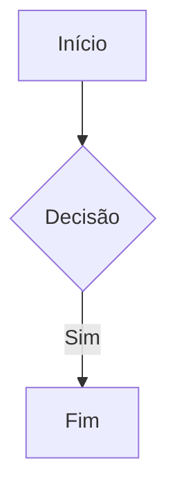

# Suporte Mermaid - Sumário de Implementação

## 📦 Pacotes Adicionados

- **mermaid@^10.x.x** - Biblioteca principal para renderizar diagramas Mermaid

## 📝 Arquivos Criados

1. **components/MermaidDiagram.tsx** - Componente React que encapsula a renderização de diagramas Mermaid
2. **docs/MERMAID_SUPORTE.md** - Documentação completa sobre uso de Mermaid no Markdown Studio

## 🔧 Arquivos Modificados

### components/MarkdownPreview.tsx
- Importado componente `MermaidDiagram`
- Modificado handler `code` para detectar blocos de código com linguagem `mermaid`
- Diagramas Mermaid são renderizados usando o novo componente em vez de bloco de código comum
- Removidos parâmetros `node` não utilizados dos handlers para conformidade com ESLint

### lib/markdown-to-docx.ts
- Adicionado tipo `'mermaid'` ao enum `ParsedMarkdown`
- Modificada função `parseMarkdown` para detectar e classificar blocos Mermaid
- Adicionado tratamento especial para blocos Mermaid na função `markdownToDocx`
- Diagramas são exportados como blocos de código formatados com rótulo "[Diagrama Mermaid]" em cor azul

## ✨ Funcionalidades Implementadas

### Preview em Tempo Real
- Diagramas Mermaid renderizam instantaneamente no painel de preview
- Suporte para todos os tipos de diagramas: flowchart, sequence, class, state, ER, Gantt, pie, git, XY
- Feedback visual de erros se a sintaxe estiver incorreta

### Exportação para DOCX
- Diagramas são preservados como blocos de código estruturados
- Cada diagrama recebe um rótulo visual: **[Diagrama Mermaid]**
- Código do diagrama é renderizado com formatação especial (fundo azulado)

### Tratamento de Erros
- Erro na renderização exibe mensagem amigável ao usuário
- Console do navegador mostra detalhes técnicos se necessário

## 🎯 Como Usar

Para adicionar um diagrama Mermaid ao seu markdown:

````markdown

````

## ✅ Validações Realizadas

- ✓ ESLint - Sem erros ou warnings
- ✓ Prettier - Formatação consistente
- ✓ TypeScript - Tipos corretos
- ✓ Next.js Build - Compilação bem-sucedida

## 📚 Exemplos Inclusos

Consulte `docs/MERMAID_SUPORTE.md` para:
- Fluxogramas
- Diagramas de sequência
- Diagramas de classes
- Diagramas ER
- Gráficos de Gantt
- Gráficos de pizza
- E mais...

## 🚀 Próximos Passos Opcionais

1. Adicionar suporte para renderizar diagramas como imagens no DOCX (requer biblioteca adicional como `mermaid-cli`)
2. Adicionar temas customizáveis para os diagramas
3. Adicionar validação em tempo real de sintaxe Mermaid
4. Adicionar botão de zoom/fullscreen para preview de diagramas grandes

