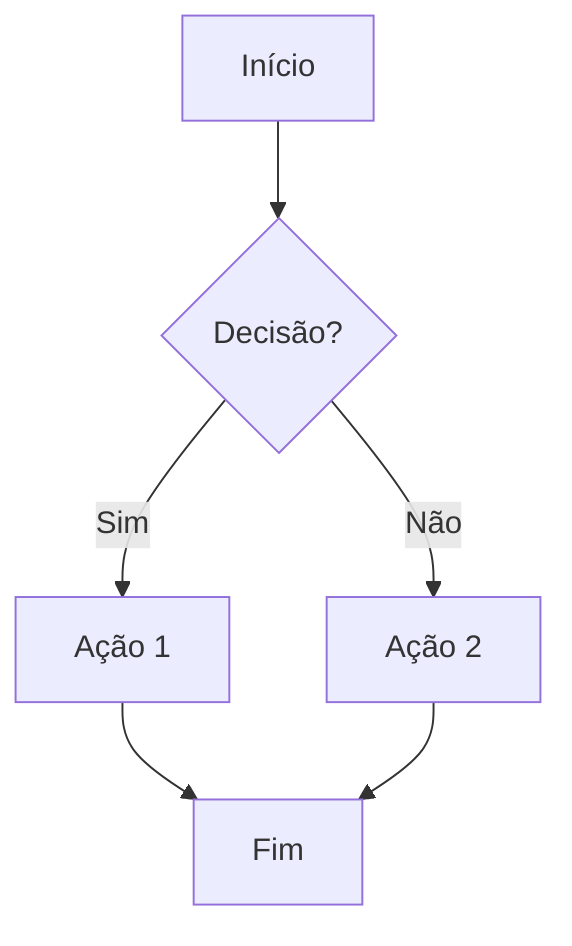
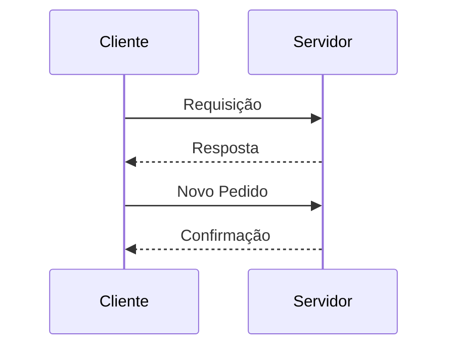
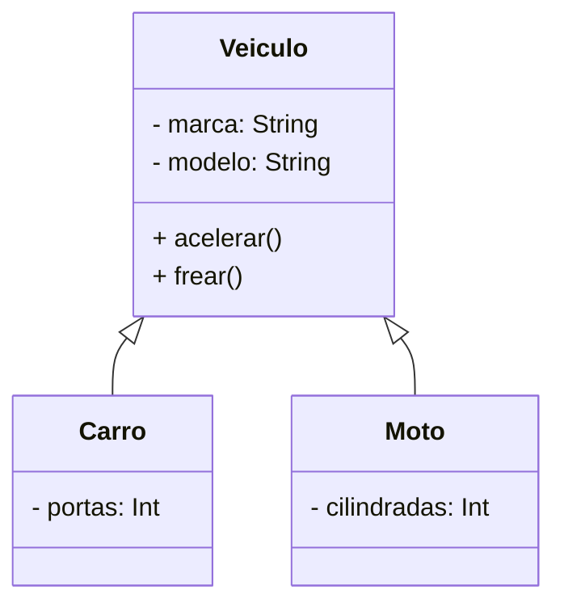
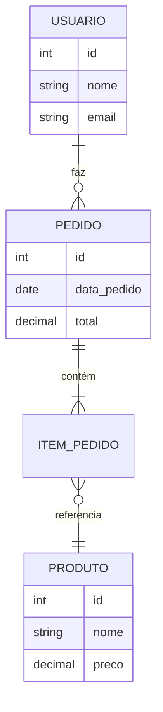
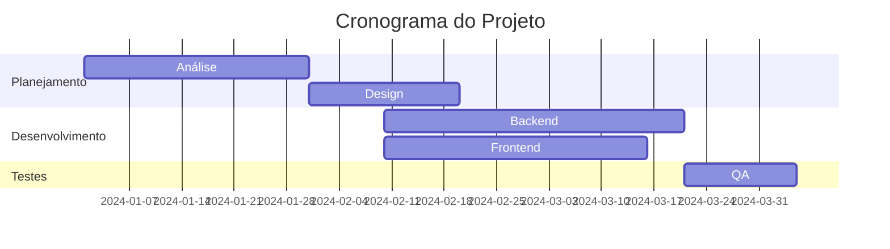
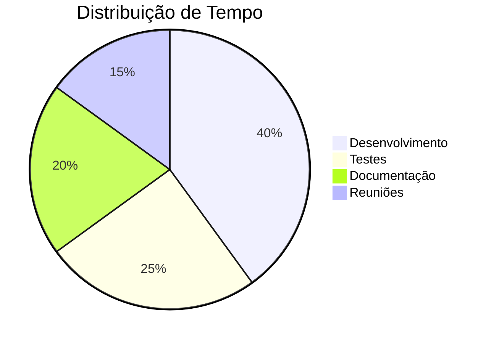

# Suporte Mermaid - Markdown Studio

## Visão Geral

O Markdown Studio agora oferece suporte completo para diagramas **Mermaid**, permitindo criar diagramas e gráficos diretamente em seus documentos markdown.

## Como Usar

Para adicionar um diagrama Mermaid, utilize um bloco de código markdown com a linguagem `mermaid`:

````markdown
```mermaid
diagrama aqui
```
````

## Exemplos

### Fluxograma Simples

````markdown

````

### Diagrama de Sequência

````markdown

````

### Diagrama de Classes

````markdown

````

### Diagrama de Entidade-Relacionamento

````markdown

````

### Gráfico de Gantt

````markdown

````

### Gráfico de Pizza

````markdown

````

## Funcionalidades

### Preview em Tempo Real

Os diagramas são renderizados instantaneamente no painel de preview enquanto você digita o markdown.

### Exportação para DOCX

Quando você exporta o documento para `.docx`, os diagramas Mermaid são incluídos como blocos de código formatados com:

- Rótulo identificador: **[Diagrama Mermaid]**
- Sintaxe do diagrama preservada
- Formatação com fundo azulado para fácil identificação

## Dicas e Boas Práticas

1. **Validação de Sintaxe**: Mermaid fornecerá feedback visual se houver erros na sintaxe do diagrama
2. **Temas**: Os diagramas usam o tema padrão do Mermaid
3. **Performance**: Para documentos muito grandes com muitos diagramas, o preview pode levar alguns segundos para renderizar
4. **Compatibilidade**: Os diagramas são renderizados como código no arquivo DOCX exportado, preservando a estrutura

## Tipos de Diagramas Suportados

- Flowchart / Fluxograma
- Sequence Diagram / Diagrama de Sequência
- Class Diagram / Diagrama de Classe
- State Diagram / Diagrama de Estado
- Entity Relationship Diagram / Diagrama ER
- Gantt Chart / Gráfico de Gantt
- Pie Chart / Gráfico de Pizza
- Git Graph / Gráfico Git
- XY Chart / Gráfico XY

## Referência Oficial

Para sintaxe completa e mais exemplos, consulte a documentação oficial: https://mermaid.js.org/

## Troubleshooting

### Diagrama não está sendo renderizado

- Verifique se o bloco está marcado com ` ```mermaid `
- Procure por erros de sintaxe no console do navegador
- Certifique-se de que a indentação está correta

### Erro "Erro ao renderizar diagrama Mermaid"

- Verifique a sintaxe do diagrama
- Consulte a documentação oficial do Mermaid para a sintaxe correta
- Tente simplificar o diagrama para identificar o problema
