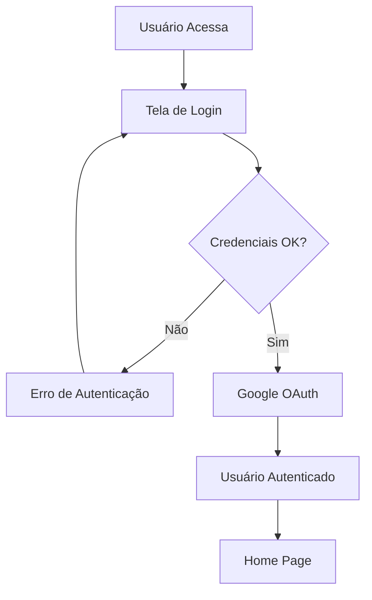
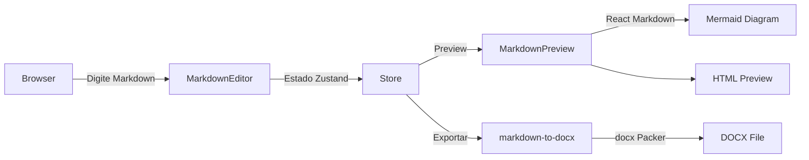
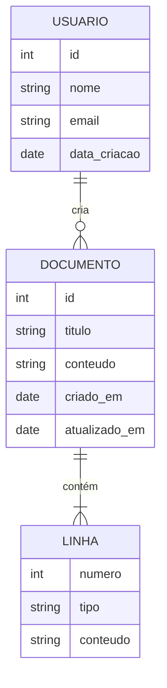
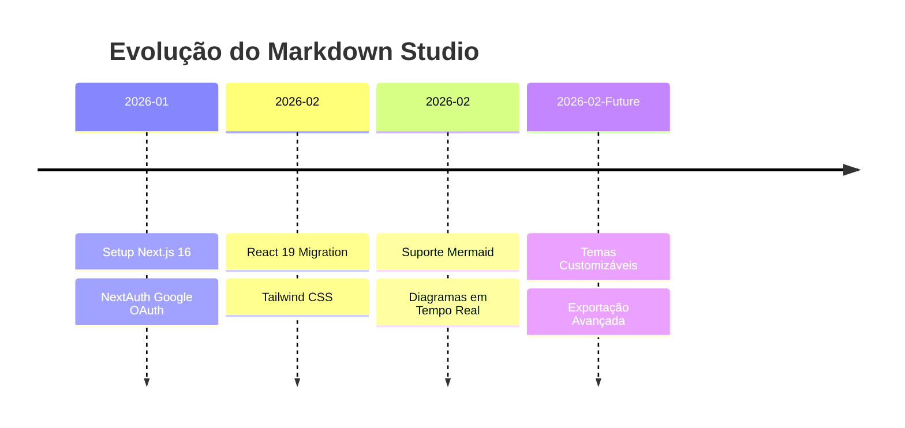

# Teste Rápido - Suporte Mermaid

Cole este conteúdo no editor Markdown para testar o suporte Mermaid:

## Fluxograma de Login

## Arquitetura Markdown Studio

## Diagrama ER - Banco de Dados

## Timeline de Desenvolvimento

Todos esses diagramas serão renderizados em tempo real no painel de preview!

