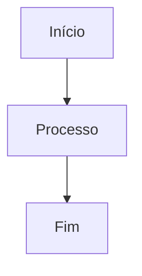

# Troubleshooting - Markdown Studio

## 🔴 Problemas de Autenticação

### "Session is null" ou "Not authenticated"

**Sintomas:**

- Redirecionamento contínuo para `/auth/signin`
- `useSession()` retorna `status: 'unauthenticated'`
- Botão "Entrar" não funciona

**Diagnóstico:**

1. **Verificar variáveis de ambiente:**

```bash
cat .env.local | grep -E "NEXTAUTH|GOOGLE"
```

Deve retornar:

```
NEXTAUTH_SECRET=seu-secret
NEXTAUTH_URL=http://localhost:3000
GOOGLE_CLIENT_ID=seu-id
GOOGLE_CLIENT_SECRET=seu-secret
```

2. **Se houver campos vazios:**

```bash
# Gerar novo NEXTAUTH_SECRET
openssl rand -base64 32

# Atualizar .env.local com valores
nano .env.local
```

3. **Limpar cookies e cache:**

- Abrir DevTools (F12)
- Ir para "Application" → "Storage"
- Clicar "Clear Site Data"
- Fechar e reabrir navegador

4. **Reiniciar servidor:**

```bash
npm run dev
```

**Solução Permanente:**

```env
# .env.local deve ter:
NEXTAUTH_SECRET=<resultado de openssl rand -base64 32>
NEXTAUTH_URL=http://localhost:3000
GOOGLE_CLIENT_ID=seu-google-client-id
GOOGLE_CLIENT_SECRET=seu-google-client-secret
```

---

### "Google authentication failed" ou erro 401 em OAuth

**Sintomas:**

- Erro na tela de login do Google
- Callback falha silenciosamente
- Redirecionamento para `/auth/signin?error=...`

**Diagnóstico:**

1. **Verificar Google Cloud Console:**
   - Acessar https://console.cloud.google.com
   - Projeto correto selecionado
   - OAuth 2.0 credentials criadas
   - Authorized JavaScript origins: `http://localhost:3000`
   - Authorized redirect URIs: `http://localhost:3000/api/auth/callback/google`

2. **Verificar `.env.local`:**

```bash
# IDs devem ser exatos (copiar/colar do Cloud Console)
GOOGLE_CLIENT_ID=seu-id-exato.apps.googleusercontent.com
GOOGLE_CLIENT_SECRET=seu-secret-exato
```

3. **Validar escopo OAuth:**

```typescript
// Em app/api/auth/[...nextauth].ts
// Verificar que scopes incluem:
scope: 'openid profile email https://www.googleapis.com/auth/drive.file';
```

**Solução:**

```bash
# Regenerar Google OAuth credentials:
# 1. Deletar credenciais antigas no Cloud Console
# 2. Criar novas OAuth 2.0 Client ID
# 3. Atualizar .env.local
# 4. Reiniciar servidor
npm run dev
```

---

## 🟡 Problemas de Persistência e Abas

### "Abas não salvam" ou "localStorage vazio"

**Sintomas:**

- Editar markdown, desconectar e reconectar perde conteúdo
- localStorage vazio em DevTools
- Novas abas criadas sempre com conteúdo padrão

**Diagnóstico:**

1. **Verificar localStorage em DevTools:**

```bash
# F12 > Application > Storage > Local Storage
# Deve ter:
markdown-studio-abas
markdown-studio-aba-ativa
```

2. **Verificar se `salvarNoStorage()` é chamado:**

```typescript
// Em components/MarkdownEditor.tsx
// Adicionar log temporário:
const handleChange = (conteudo: string) => {
  atualizarAba(abaAtiva, conteudo);
  // DEBUG:
  console.log('Conteúdo atualizado:', conteudo);
  salvarNoStorage(abaAtiva);
};
```

3. **Verificar se localStorage está corrompido:**

```javascript
// No console do navegador (F12):
localStorage.getItem('markdown-studio-abas');
// Se retorna algo inválido ou null:
localStorage.clear();
location.reload();
```

4. **Verificar se `carregarDoStorage()` é chamado ao iniciar:**

```typescript
// Em app/page.tsx
useEffect(() => {
  console.log('Carregando do storage...');
  carregarDoStorage();
}, [carregarDoStorage]);
```

**Solução:**

```typescript
// lib/store.ts - Validar funções

carregarDoStorage: () => {
  if (typeof window === 'undefined') return;

  const storedAbas = localStorage.getItem('markdown-studio-abas');
  const storedAbaAtiva = localStorage.getItem('markdown-studio-aba-ativa');

  if (storedAbas) {
    set({ abas: JSON.parse(storedAbas) });
  }
  if (storedAbaAtiva) {
    set({ abaAtiva: storedAbaAtiva });
  }
},

salvarNoStorage: (abaId?: string) => {
  if (typeof window === 'undefined') return;

  const state = get();
  localStorage.setItem('markdown-studio-abas', JSON.stringify(state.abas));
  localStorage.setItem('markdown-studio-aba-ativa', state.abaAtiva);

  // Timestamp visual
  if (abaId) {
    const now = new Date();
    const hora = now.toLocaleTimeString('pt-BR');
    set(state => ({
      abas: state.abas.map(aba =>
        aba.id === abaId ? { ...aba, salvoAoMemento: `Salvo às ${hora}` } : aba
      )
    }));
  }
},
```

---

### "Aba não renderiza preview" ou "Preview em branco"

**Sintomas:**

- Editor mostra markdown, preview vazio
- Trocar de abas e preview desaparece
- Sem erros no console

**Diagnóstico:**

1. **Verificar se `abaAtiva` está definida:**

```typescript
// Em app/page.tsx, adicionar log:
const { abaAtiva, abas } = useAppStore();
console.log('Aba ativa:', abaAtiva);
console.log('Abas:', abas);
```

Deve ter ID válido em `abaAtiva`.

2. **Verificar se aba contém conteúdo:**

```typescript
// Console:
const store = useAppStore.getState();
const abaAtual = store.abas.find((a) => a.id === store.abaAtiva);
console.log('Aba atual:', abaAtual);
console.log('Conteúdo:', abaAtual?.conteudo);
```

3. **Testar com markdown simples:**

```markdown
# Título

Parágrafo simples
```

Se preview ainda está vazio, problema é em `MarkdownPreview.tsx`.

4. **Verificar console para erros de React Markdown:**

- F12 → Console
- Procurar por erros vermelhos
- Se houver erro em plugin remark, será mostrado aqui

**Solução:**

```typescript
// components/MarkdownPreview.tsx
export const MarkdownPreview: React.FC = () => {
  const { abaAtiva, abas } = useAppStore();
  const abaAtual = abas.find(a => a.id === abaAtiva);

  // Debug
  useEffect(() => {
    console.log('MarkdownPreview renderizando', {
      abaAtiva,
      abaAtualId: abaAtual?.id,
      conteudo: abaAtual?.conteudo?.substring(0, 50),
    });
  }, [abaAtiva, abaAtual]);

  if (!abaAtual) {
    return <div className="p-4">Nenhuma aba selecionada</div>;
  }

  return (
    <ReactMarkdown
      remarkPlugins={[remarkGfm, remarkBreaks, remarkEmoji, remarkToc, remarkMath]}
      rehypePlugins={[[rehypeKatex, {}]]}
      components={customComponents}
    >
      {abaAtual.conteudo}
    </ReactMarkdown>
  );
};
```

---

## 🔴 Problemas de Exportação DOCX

### "Export não funciona" ou "Download não inicia"

**Sintomas:**

- Clicar em "Exportar" não faz nada
- Sem erro, sem download
- Console está limpo

**Diagnóstico:**

1. **Verificar se `markdownToDocx()` executa:**

```typescript
// Adicionar log em Header.tsx
const handleExportarTodas = async () => {
  console.log('Iniciando exportação...');
  for (const aba of abas) {
    console.log(`Exportando aba: ${aba.nome}`);
    await markdownToDocx(aba.conteudo, aba.nome);
    await new Promise((resolve) => setTimeout(resolve, 500));
  }
  console.log('Exportação completa');
};
```

2. **Verificar tamanho do arquivo:**

- Markdown muito grande pode falhar
- Se > 10MB, quebrar em múltiplos documentos

3. **Verificar permissões de download:**

- Navegador bloqueou downloads?
- F12 → Application → Permissions
- Permitir downloads do localhost

4. **Testar com markdown simples:**

```markdown
# Título

Parágrafo
```

Se funciona com simples, problema está no markdown complexo.

**Solução:**

```typescript
// lib/markdown-to-docx.ts
export const markdownToDocx = async (conteudo: string, nomeArquivo: string) => {
  try {
    console.log('Iniciando conversão:', { nomeArquivo, tamanho: conteudo.length });

    const parsedContent = parseMarkdown(conteudo);
    console.log('Markdown parseado:', parsedContent);

    const document = new Document({
      sections: [
        {
          children: parsedContent.map(converterParaParagraph),
        },
      ],
    });

    const blob = await Packer.toBlob(document);
    console.log('Blob criado:', { tamanho: blob.size });

    const url = URL.createObjectURL(blob);
    const a = document.createElement('a');
    a.href = url;
    a.download = `${nomeArquivo}.docx`;
    a.click();
    URL.revokeObjectURL(url);

    console.log('Download iniciado');
  } catch (erro) {
    console.error('Erro ao exportar:', erro);
  }
};
```

---

### "DOCX vazio" ou "Conteúdo perdido na exportação"

**Sintomas:**

- Arquivo baixa, mas está vazio
- Apenas alguns parágrafos aparecem
- Tabelas ou listas não aparecem

**Diagnóstico:**

1. **Verificar parsing de markdown:**

```typescript
// Adicionar log em markdown-to-docx.ts
const parseMarkdown = (conteudo: string) => {
  const lines = conteudo.split('\n');
  console.log(`Parseando ${lines.length} linhas...`);

  const parsed = [];
  // ... parsing logic ...
  console.log('Resultado parseado:', parsed);
  return parsed;
};
```

2. **Verificar tipos suportados:**

- `heading` ✅
- `paragraph` ✅
- `list` (renderizado como Paragraph com marcadores)
- `code` ✅
- `table` ✅
- `mermaid` ❌ (renderizado como código)
- Imagens ❌ (não suportadas)

3. **Testar conversão individual:**

```bash
# Criar arquivo test.md com markdown simples
npm run dev

# Editar no editor e exportar
# Verificar DOCX em Word
```

**Solução:**

Validar cada tipo de elemento em `markdown-to-docx.ts`:

```typescript
const converterParaParagraph = (element: ParsedMarkdown): Paragraph | Table => {
  switch (element.type) {
    case 'heading':
      return new Paragraph({
        text: element.content,
        heading: HeadingLevel[`HEADING_${element.level}`],
        style: `Heading${element.level}`,
      });

    case 'paragraph':
      return new Paragraph({
        text: element.content,
        spacing: { after: 200 },
      });

    case 'list':
      return new Paragraph({
        text: `• ${element.content}`,
        style: 'ListParagraph',
      });

    case 'code':
      return new Paragraph({
        text: element.content,
        style: 'Code',
      });

    case 'table':
      return construirTabela(element);

    case 'mermaid':
      return new Paragraph({
        text: `[Diagrama Mermaid não suportado em DOCX]`,
        style: 'Code',
      });

    default:
      return new Paragraph({ text: '' });
  }
};
```

---

## 🟡 Problemas com Diagramas Mermaid

### "Diagrama Mermaid não renderiza" ou "Erro vermelho"

**Sintomas:**

- Bloco ` ```mermaid ` aparece como código em vez de diagrama
- Div vermelho com mensagem de erro
- Sintaxe válida no mermaid.live mas não funciona aqui

**Diagnóstico:**

1. **Validar sintaxe no mermaid.live:**
   - Copiar diagrama para https://mermaid.live
   - Se erro lá, é problema de sintaxe Mermaid

2. **Verificar console para erro específico:**

```bash
F12 → Console
# Procurar por:
# "Error: [mensagem de erro do Mermaid]"
```

3. **Verificar se `<br/>` está quebrando diagrama:**

```typescript
// lib/mermaid-cleaner.ts
export const limparDiagramaMermaid = (conteudo: string): string => {
  // Remove tags <br/>, <br>, </br> que quebram Mermaid
  return conteudo.replace(/<br\s*\/?>/gi, '').replace(/<\/br>/gi, '');
};
```

4. **Verificar inicialização do Mermaid:**

```typescript
// components/MermaidDiagram.tsx
useEffect(() => {
  if (!diagramRef.current) return;

  mermaid.initialize({
    theme: 'default',
    securityLevel: 'loose', // Permite rendering de URLs
    startOnLoad: false,
  });

  const renderDiagram = async () => {
    try {
      const { svg, bindFunctions } = await mermaid.render(`diagram-${Date.now()}`, conteudoLimpo);
      diagramRef.current!.innerHTML = svg;
      bindFunctions?.(diagramRef.current);
    } catch (erro) {
      console.error('Erro ao renderizar Mermaid:', erro);
      diagramRef.current!.innerHTML = `<div style="color: red;">Erro: ${(erro as Error).message}</div>`;
    }
  };

  renderDiagram();
}, [conteudoLimpo]);
```

**Solução:**

1. **Validar sintaxe:**



2. **Remover quebras de linha dentro do diagrama:**

````markdown
# ❌ Errado


````

# ✅ Correto


````

3. **Verificar quotes e caracteres especiais:**
```markdown
# ❌ Pode falhar
A["Texto com 'aspas' dentro"]

# ✅ Melhor usar escape
A["Texto com caracteres especiais"]
````

---

### "Diagrama não exporta para DOCX"

**Sintomas:**

- Preview mostra diagrama corretamente
- DOCX baixa mas diagrama não aparece
- Vê bloco de código em vez de diagrama

**Esperado:**
Mermaid é renderizado como bloco de código em DOCX. Não há suporte nativo para SVG/PNG.

**Solução:**
Documento em `lib/markdown-to-docx.ts`:

```typescript
case 'mermaid':
  return new Paragraph({
    text: `[Diagrama Mermaid: ${element.content.split('\n')[0]}...]`,
    style: 'Code',
  });
```

---

## 🔴 Problemas com Google Drive Integration

### "Salvar no Google Drive falha" ou "500 error"

**Sintomas:**

- Clica "Salvar no Drive", nada acontece
- Error 500 no console
- Toast com mensagem de erro

**Diagnóstico:**

1. **Verificar se sessão tem accessToken:**

```typescript
// No componente que chama salvarNoGoogleDrive:
const { data: session } = useSession();
console.log('Session:', session);
console.log('AccessToken:', (session?.user as any)?.accessToken);

// Deve ter token válido
```

2. **Verificar escopo OAuth:**

```typescript
// app/api/auth/[...nextauth].ts
const authOptions = {
  providers: [
    GoogleProvider({
      clientId: process.env.GOOGLE_CLIENT_ID!,
      clientSecret: process.env.GOOGLE_CLIENT_SECRET!,
      authorization: {
        params: {
          scope: 'openid profile email https://www.googleapis.com/auth/drive.file',
        },
      },
    }),
  ],
  // ...
};
```

O escopo **deve incluir** `https://www.googleapis.com/auth/drive.file`.

3. **Verificar permissões no Google Cloud:**
   - Console Cloud → APIs & Services
   - Google Drive API ativada
   - OAuth consent screen configurada (user type: External)
   - Tester users adicionados

4. **Testar endpoint manualmente:**

```bash
# Terminal
curl -X POST http://localhost:3000/api/salvar-no-drive \
  -H "Content-Type: application/json" \
  -d '{"conteudo":"# Teste","nomeArquivo":"teste"}'

# Deve retornar erro de autenticação (esperado sem token)
```

5. **Verificar logs do servidor:**

```bash
# Terminal onde npm run dev está rodando
# Procurar por erros em POST /api/salvar-no-drive
```

**Solução:**

```typescript
// app/api/salvar-no-drive/route.ts
import { getServerSession } from 'next-auth/next';
import { NextRequest, NextResponse } from 'next/server';
import { google } from 'googleapis';
import { authOptions } from '../auth/[...nextauth]';
import { markdownToDocx } from '@/lib/markdown-to-docx';

export async POST(req: NextRequest) {
  try {
    // 1. Validar sessão
    const session = await getServerSession(authOptions);
    if (!session?.user) {
      return NextResponse.json(
        { sucesso: false, mensagem: 'Não autenticado' },
        { status: 401 }
      );
    }

    // 2. Extrair token
    const accessToken = (session.user as any).accessToken;
    if (!accessToken) {
      return NextResponse.json(
        { sucesso: false, mensagem: 'AccessToken não disponível' },
        { status: 401 }
      );
    }

    // 3. Parse request
    const { conteudo, nomeArquivo } = await req.json();
    if (!conteudo || !nomeArquivo) {
      return NextResponse.json(
        { sucesso: false, mensagem: 'Conteúdo ou nome ausente' },
        { status: 400 }
      );
    }

    // 4. Converter markdown para DOCX
    const docxBlob = await markdownToDocx(conteudo, nomeArquivo);

    // 5. Fazer upload no Google Drive
    const auth = new google.auth.OAuth2();
    auth.setCredentials({ access_token: accessToken });

    const drive = google.drive({ version: 'v3', auth });
    const fileMetadata = {
      name: `${nomeArquivo}.docx`,
      mimeType: 'application/vnd.openxmlformats-officedocument.wordprocessingml.document',
    };

    const media = {
      mimeType: 'application/vnd.openxmlformats-officedocument.wordprocessingml.document',
      body: docxBlob,
    };

    const response = await drive.files.create({
      requestBody: fileMetadata,
      media: media,
      fields: 'id, webViewLink',
    });

    return NextResponse.json({
      sucesso: true,
      mensagem: 'Arquivo salvo no Google Drive',
      idArquivo: response.data.id,
      urlArquivo: response.data.webViewLink,
    });

  } catch (erro) {
    console.error('Erro ao salvar no Drive:', erro);
    return NextResponse.json(
      { sucesso: false, mensagem: (erro as Error).message },
      { status: 500 }
    );
  }
}
```

---

## 🟡 Problemas de Build e TypeScript

### "Type errors ao fazer build"

**Sintomas:**

- `npm run build` falha com erros de tipo
- Código funciona em dev mas falha em build

**Diagnóstico:**

```bash
# Verificar erros de tipo sem build completo
npx tsc --noEmit

# Verificar warnings específicos
npm run lint
```

**Solução Comum:**

```typescript
// ❌ Erro: `any` implícito
const handleChange = (props) => {
  // props é `any`
  return props.value;
};

// ✅ Correto
interface ChangeProps {
  value: string;
}

const handleChange = (props: ChangeProps) => {
  return props.value;
};
```

---

### "ESLint/Prettier errors impede build"

**Sintomas:**

- `npm run build` falha mesmo sem type errors
- Mensagem: "ESLint found X warnings"

**Diagnóstico:**

```bash
npm run lint --debug
```

**Solução:**

```bash
# Corrigir automaticamente
npm run lint:fix

# Formatar com Prettier
npm run format

# Verificar resultado
npm run lint
```

---

## 🔵 Problemas de Performance

### "Editor lento" ou "Preview travando"

**Sintomas:**

- Digitação com lag
- Scroll lento
- Memória crescendo

**Diagnóstico:**

1. **Verificar tamanho do markdown:**

```typescript
const { abaAtual } = useAppStore();
console.log('Tamanho do markdown:', abaAtual.conteudo.length, 'caracteres');

// Se > 100KB, é grande
// Se > 500KB, considerar quebrar em múltiplas abas
```

2. **Verificar re-renders desnecessários:**

```bash
# Usar React DevTools Profiler (F12 → Profiler)
# Gravar interação
# Procurar por componentes que re-render sem necessidade
```

3. **Verificar plugins remark:**

- `remarkToc` é lento em documentos grandes
- `remarkMath` pode ser lento com muitas equações

**Solução:**

```typescript
// Limitar tamanho de markdown
const MAX_TAMANHO = 100000; // 100KB

const handleChange = (conteudo: string) => {
  if (conteudo.length > MAX_TAMANHO) {
    alert('Arquivo muito grande. Máximo 100KB.');
    return;
  }
  atualizarAba(abaAtiva, conteudo);
};

// Ou quebrar em múltiplas abas
```

---

## 🟠 Problemas Comuns de Desenvolvimento

### "Port 3000 already in use"

**Solução:**

```bash
# macOS/Linux
kill -9 $(lsof -t -i :3000)

# Ou usar porta diferente
PORT=3001 npm run dev
```

---

### "npm install falha com dependências conflitantes"

**Solução:**

```bash
rm -rf node_modules package-lock.json
npm install
npm run dev
```

---

### "localStorage não limpa entre testes"

**Solução em testes:**

```typescript
beforeEach(() => {
  localStorage.clear();
  const { fecharTodasAsAbas } = useAppStore.getState();
  fecharTodasAsAbas();
});
```

---

## 📋 Checklist de Debug Rápido

Quando algo não funciona:

1. ✅ Verificar console: F12 → Console (erros vermelhos?)
2. ✅ Limpar cache: DevTools → "Clear Site Data"
3. ✅ Restart servidor: Ctrl+C, `npm run dev`
4. ✅ Verificar `.env.local`: tem todas as variáveis?
5. ✅ Verificar localStorage: F12 → Application → Storage
6. ✅ Verificar network: F12 → Network (requisições falhando?)
7. ✅ Testar em navegador incógnito (sem extensões)
8. ✅ Verificar tamanho de arquivo (muito grande?)

---

## 🔗 Referências Úteis

- **Mermaid Syntax:** https://mermaid.live
- **LaTeX Math:** https://katex.org
- **Markdown Spec:** https://commonmark.org
- **NextAuth.js Docs:** https://next-auth.js.org
- **Google Drive API:** https://developers.google.com/drive
- **Next.js 16 Docs:** https://nextjs.org
